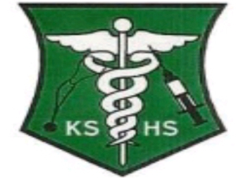

# mynew-blog
this is a simple school blog i created for kamapala school of health sciences
<!DOCTYPE html>
<html lang="en">

<head>
  <meta charset="UTF-8">
  <meta http-equiv="X-UA-Compatible" content="IE=edge">
  <meta name="viewport" content="width=device-width, initial-scale=1.0">
  <title>kampala school of health sciences</title>

  <!--
    - favicon
  -->
  <link rel="shortcut icon" href="./assets/images/favicon.ico" type="image/x-icon">
  <link rel="icon"href="kshs.png" type="image/x-icon">
  <link rel="stylesheets"href="newstyle.css">
  <!--
    - custom css link 
  -->
  <link rel="stylesheet" href="newstyle.css">
  

  <!--
    - google font link
  -->
  <link rel="preconnect" href="https://fonts.googleapis.com">
  <link rel="preconnect" href="https://fonts.gstatic.com" crossorigin>
  <link href="https://fonts.googleapis.com/css2?family=Inter:wght@400;500;600;700;900&display=swap" rel="stylesheet">
</head>

<body class="light-theme">

  <!--
    - #HEADER
  -->

  <header>

    

      <nav class="navbar">

        <a href="#">
          <strong class="tg-logo"></strong>
						
        </a>
        

          
        
          
          

          <button class="nav-menu-btn">
            <ion-icon name="menu-outline"></ion-icon>
          </button>

        

        

          <ul class="desktop-nav"> <!--
            - #HEADER desktop navigation
          -->
          
            <li>
              <a href="kshs.html" class="active">Home</a>
            </li>
            <li>
              <a href="#" class="nav-link">Upcoming Events</a>
            </li>
            <li>
              <a href="aboutkshs.html" class="nav-link">About Us</a>
            </li>
          
            <li>
              <a href="#" class="nav-link">Courses</a>
              
            </li>
            <li>
              <a href="contacts.html" class="nav-link">Contacts Us</a>
            </li>

          </ul>
 
          <button class="theme-btn theme-btn-desktop light">
            <ion-icon name="moon" class="moon"></ion-icon>
            <ion-icon name="sunny" class="sun"></ion-icon>
          </button>
        

         <!--
    - #HEADER mobile phone navigation bar
  -->
        
        

          <button class="nav-close-btn">
            <ion-icon name="close-outline"></ion-icon>
          </button>

          

            
Main Menu

            <ul>
              <li class="nav-item">
                <a href="#" class="nav-link">Home</a>
              </li>
  
              <li>
                <a href="#" class="nav-link">About Us</a>
              </li>
              <li>
                <a href="#" class="nav-link">Courses<button type="button" class="collapsible">+</button></a>
                <ul>
                  <li>
                    Diploma Courses
                  </li>
                  <li>
                    Certificate Courses
                  </li>
                  <li>
                    Short Courses
                  </li>
                </ul>
              </li>
              <li>
                <a href="#" class="nav-link">Contacts Us</a>
              </li>
  
            </ul>

          

          

            
             <!--
    - #HEADER topics part
  -->
  
  
          
           

          

        

      </nav>

    

  </header>

  <main>

    <!--
      - #HERO SECTION
    -->

    

      

        

          <h1 class="h1">
            Welcome To Kampala School Of Health Sciences
             
          </h1>

          

            Health Is Life.
          

          

            <a href="kshs.html" class="btn btn-primary">HOME</a>
            <a href="onlineapplication.html" class="btn btn-secondary">APPLY ONLINE</a>
          

        

        

          

          

            
            

            

          

        

      

    

    

      

        <!--
          - BLOG SECTION
        -->
    
        

          <h2 class="h2">Latest Blog Posts</h2>

          

         
            

              

                
              

              

                <button class="blog-topic text-tiny">Accademics</button>

                <h3>
                  <a href="#" class="h3">Kshs Scoops Gold at the Second National Skills Competitions</a></h3>

                

                  
                

                

                  World Skills Uganda 2022 was a aserries of capacity building workshops focusing on the collavoratice mentorship between world skills interrnational edp0erts and the National experts
                  the competition took place between.....and......... with the joint efforts of the african union and world skills uganda
                  disability we can optimize for: visual, hearing, mobility, cognition, speech and neural. Many tools
                  and resources can
                  help here, even if you're totally new to web accessibility.
                

              

                

                  

                    
                  

                  

                    <a href="#" class="h4">Apollo Emmanuel</a>

                    

                      <time datetime="2021-11-28"></time>
                      
                      <ion-icon name="time-outline"></ion-icon>
                      <time datetime="PT4M">4M</time>
                    

                  

                

              

            

         
          
            

              

                
              

              

                <button class="blog-topic text-tiny">Graduations</button>

                <h3><a href="" class="h3">Graduations at kampala school of health sciences </a></h3>

                

                  
                

                

                  World Skills Uganda 2022 was a aserries of capacity building workshops focusing on the collavoratice mentorship between world skills interrnational edp0erts and the National experts
                  the competition took place between.....and......... with the joint efforts of the african union and world skills uganda
                  disability we can optimize for: visual, hearing, mobility, cognition, speech and neural. Many tools
                  and resources can
                  help here, even if you're totally new to web accessibility.
                

              

                

                  

                    
                  

                  

                    <a href="#" class="h4">Apollo Emmanuel</a>

                    

                      <time datetime="2021-11-28"></time>
                      
                      <ion-icon name="time-outline"></ion-icon>
                      <time datetime="PT4M">4M</time>
                    

                  

                

              

            

            
          
         
            

              

                
              

              

                <button class="blog-topic text-tiny">Sports</button>

                <h3><a href="" class="h3">Kshs at the National Medical Schools Sports Competitions</a></h3>

                

                  
                

                

                  World Skills Uganda 2022 was a aserries of capacity building workshops focusing on the collavoratice mentorship between world skills interrnational edp0erts and the National experts
                  the competition took place between.....and......... with the joint efforts of the african union and world skills uganda
                  disability we can optimize for: visual, hearing, mobility, cognition, speech and neural. Many tools
                  and resources can
                  help here, even if you're totally new to web accessibility.
                

              

                

                  

                    
                  

                  

                    <a href="#" class="h4">Apollo Emmanuel</a>

                    

                      <time datetime="2021-11-28"></time>
                      
                      <ion-icon name="time-outline"></ion-icon>
                      <time datetime="PT4M">4M</time>
                    

                  

                

              

            

            
            

              

                
              

              

                <button class="blog-topic text-tiny">internships</button>

                <h3><a href="" class="h3">internships and Pacements.</a></h3>

                

                  
                

                

                  World Skills Uganda 2022 was a aserries of capacity building workshops focusing on the collavoratice mentorship between world skills interrnational edp0erts and the National experts
                  the 
                

              

                

                  

                    
                  

                  

                    <a href="#" class="h4">Apollo Emmanuel</a>

                    

                      <time datetime="2021-11-28"></time>
                      
                      <ion-icon name="time-outline"></ion-icon>
                      <time datetime="PT4M">4M</time>
                    

                  

                

              

            

            
            

              

                
              

              

                <button class="blog-topic text-tiny">Accademics</button>

                <h3><a href="" class="h3">Kshs takes part in #mama-wange health camp  </a></h3>

                

                  
                

                

                  World Skills Uganda 2022 was a aserries of capacity building workshops focusing on the collavoratice mentorship between world skills interrnational edp0erts and the National experts
                  the competition took place between.....and......... with the joint efforts of the african union and world skills uganda
                  disability we can optimize for: visual, hearing, mobility, cognition, speech and neural. Many tools
                  and resources can
                  help here, even if you're totally new to web accessibility.
                

              

                

                  

                    
                  

                  

                    <a href="#" class="h4">Apollo Emmanuel</a>

                    

                      <time datetime="2021-11-28"></time>
                      
                      <ion-icon name="time-outline"></ion-icon>
                      <time datetime="PT4M">4M</time>
                    

                  

                

              

            

            
            

              

                
              

              

                <button class="blog-topic text-tiny">outreaches</button>

                <h3><a href="" class="h3">Kshs Scoops Gold at the Second National Skills Competitions</a></h3>

                

                  
                

                

                  World Skills Uganda 2022 was a aserries of capacity building workshops focusing on the collavoratice mentorship between world skills interrnational edp0erts and the National experts
                  the competition took place between.....and......... with the joint efforts of the african union and world skills uganda
                  disability we can optimize for: visual, hearing, mobility, cognition, speech and neural. Many tools
                  and resources can
                  help here, even if you're totally new to web accessibility.
                

              

                

                  

                    
                  

                  

                    <a href="#" class="h4">Apollo Emmanuel</a>

                    

                      <time datetime="2021-11-28"></time>
                      
                      <ion-icon name="time-outline"></ion-icon>
                      <time datetime="PT4M">4M</time>
                    

                  

                

              

            

            
            

              

                
              

              

                <button class="blog-topic text-tiny">Accademics</button>

                <h3><a href="" class="h3">Kshs Scoops Gold at the Second National Skills Competitions</a></h3>

                

                  
                

                

                  World Skills Uganda 2022 was a aserries of capacity building workshops focusing on the collavoratice mentorship between world skills interrnational edp0erts and the National experts
                  the competition took place between.....and......... with the joint efforts of the african union and world skills uganda
                  disability we can optimize for: visual, hearing, mobility, cognition, speech and neural. Many tools
                  and resources can
                  help here, even if you're totally new to web accessibility.
                

              

                

                  

                    
                  

                  

                    <a href="#" class="h4">Apollo Emmanuel</a>

                    

                      <time datetime="2021-11-28"></time>
                      
                      <ion-icon name="time-outline"></ion-icon>
                      <time datetime="PT4M">4M</time>
                    

                  

                

              

            

            
            
            
            

              

                
              

              

                <button class="blog-topic text-tiny">Accademics</button>

                <h3><a href="" class="h3">Kshs Scoops Gold at the Second National Skills Competitions</a></h3>

                

                  
                

                

                  World Skills Uganda 2022 was a aserries of capacity building workshops focusing on the collavoratice mentorship between world skills interrnational edp0erts and the National experts
                  the competition took place between.....and......... with the joint efforts of the african union and world skills uganda
                  disability we can optimize for: visual, hearing, mobility, cognition, speech and neural. Many tools
                  and resources can
                  help here, even if you're totally new to web accessibility.
                

              

                

                  

                    
                  

                  

                    <a href="#" class="h4">Apollo Emmanuel</a>

                    

                      <time datetime="2021-11-28"></time>
                      
                      <ion-icon name="time-outline"></ion-icon>
                      <time datetime="PT4M">4M</time>
                    

                  

                

              

            

            
            
            
            

              

                
              

              

                <button class="blog-topic text-tiny">Accademics</button>

                <h3><a href="" class="h3">Placements and internships</a></h3>

                

                  
                

                

                  World Skills Uganda 2022 was a aserries of capacity building workshops focusing on the collavoratice mentorship between world skills interrnational edp0erts and the National experts
                  the competition took place between.....and......... with the joint efforts of the african union and world skills uganda
                  disability we can optimize for: visual, hearing, mobility, cognition, speech and neural. Many tools
                  and resources can
                  help here, even if you're totally new to web accessibility.
                

              

                

                  

                    
                  

                  

                    <a href="#" class="h4">Apollo Emmanuel</a>

                    

                      <time datetime="2021-11-28"></time>
                      
                      <ion-icon name="time-outline"></ion-icon>
                      <time datetime="PT4M">4M</time>
                    

                  

                

              

            

            
            
            

              

                
              

              

                <button class="blog-topic text-tiny">Accademics</button>

                <h3><a href="" class="h3">Kshs takes part in #mama-wange health camp</a></h3>

                

                   

                  

                  Javascript for both the backend and frontend as well as a document-oriented or non relational database
                  (MongoDB),
                  meaning that it's structured like JSON rather than a large excel sheet like SQL databases are.
                

                

                

                  

                    
                  

                  

                    <a href="#" class="h4">Apollo Emmanuel</a>

                    

                      <time datetime="2021-09-21">jan 21, 2022</time>
                      
                      <ion-icon name="time-outline"></ion-icon>
                      <time datetime="PT4M">4 min</time>
                    

                  

                

              

            

          

          <button class="btn load-more">Load More</button>

        

        <!--
          - ASIDE
        -->

        

          

            <h2 class="h2">Topics</h2>

            <a href="onlineapplication.html" class="topic-btn">
              

                <ion-icon name="server-outline"></ion-icon>
              

              
APPLY ONLINE

            </a>

            <a href="#" class="topic-btn">
              

                <ion-icon name="accessibility-outline"></ion-icon>
              

              
COURSES

            </a>

            <a href="#" class="topic-btn">
              

                <ion-icon name="rocket-outline"></ion-icon>
              

              
LOCATION

            </a>

          

          

            <h2 class="h2">Tags</h2>

            

              <button class="hashtag">#Graduations</button>
              <button class="hashtag">#Sports</button>
              <button class="hashtag">#Placement</button>
              <button class="hashtag">#MDD</button>
              <button class="hashtag">#Guild councel</button>
              <button class="hashtag">#Galary</button>
              <button class="hashtag">#Christian Community</button>
              <button class="hashtag">#Islamic Community</button>

            

          

          

            <h2 class="h2">Let's Talk</h2>

            

              

                Do you want to learn more about how we can join hands with you to help you develop and overcome problems? Let us have a
                conversation.
              

              <ul class="social-link">

                <li>
                  <a href="#" class="icon-box discord">
                    <ion-icon name="logo-discord"></ion-icon>
                  </a>
                </li>

                <li>
                  <a href="#" class="icon-box twitter">
                    <ion-icon name="logo-twitter"></ion-icon>
                  </a>
                </li>

                <li>
                  <a href="#" class="icon-box facebook">
                    <ion-icon name="logo-facebook"></ion-icon>
                  </a>
                </li>

              </ul>

            

          

          

            <h2 class="h2">

            

              

                submit your email to get intouch with the School Administration
              

              <form action action="mailto:emmanueleewaru@gamil.com" method="post" enctype="text/plain">
                Name:<input type="text"name="first name">
                
              Question:<input type="text"Question="your question...">
               email: <input type="email" name="email" placeholder="Email Address" required>

                <button type="submit" class="btn btn-primary">Submit</button>
              </form>

            

           </h2>
          

        

      

    

  </main>

  <!--
    - #FOOTER
  -->

  <footer>

    

      

        

        

          Learn more about kampala school of health sciences
        

      

      

        
Quick Links

        <ul>

          <li>
            <a href="#" class="footer-link">visit us</a>
          </li>

          <li>
            <a href="onlineapplication.html" class="footer-link">Appy online</a>
          </li>

          <li>
            <a href="#" class="footer-link">Contact Us</a>
          </li>

        </ul>

      

     

    

    

      &copy; Copyright 2022 <a href="#">Apolloproject01</a>
    

  </footer>

 <!--
    - custom js link
  -->
 <!-- -->
 
 <!--
   - ionicon link
 -->
 
 
</body>

</html>
